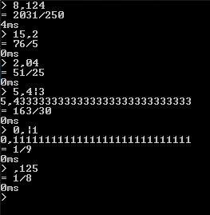

# Decimal To Fraction
 A small CL REPL to convert any decimal number into a fraction.

## Syntax

The REPL accepts **'all' real numbers** per default. Irrational numbers with infinite repeating decimals must be formatted using the `|` operator. On the left-hand side of the `|` operator, is the integer part and any constant decimals (the comma must be to the left of the `|` operator as well), and on the right-hand side is the infinite repeating pattern of decimals.

| Expression  | Finite Representation     | Fraction |
| ----------- | ------------------------- | -------- |
| 5,4\|3      | 5,4333333333333333333 ... | 163/30   |
| 0,\|15      | 0,1515151515151515151 ... | 5/33     |
| ~~30\|6,1~~ | Invalid.                  | -        |

## Limitations

Each number must be between **-9,223,372,036,854,775,808** and **9,223,372,036,854,775,807**, with a decimal Precision of **28-29** digits, where as **18** is decimals places.